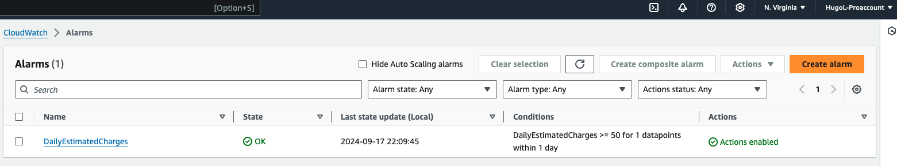

# Week 0 — Billing and Architecture

I was able to install AWS CLI directly on Gitpod by following instructions on the [AWS CLI Install Documentation page](https://docs.aws.amazon.com/cli/latest/userguide/getting-started-install.html)

### Create a budget 
I created a budget alarm for $1 to keep cost down as I was learning how to do stuff. 
I do have a second budget setup but will be deleted soon for concerns of two budget limit on the free tier 

### Create an alarm 

I created an alarm using CloudWatch for activity and to keep in the free tier as much as possible 

### Logical Architecture diagram

I recreated this Architechture design using Lucid Charts to practice and understand a basic design 

### Logical Architecture Diagram link
[Lucid Charts Share link](https://lucid.app/lucidchart/1ff8b924-543c-4931-a644-7305f1505c20/edit?viewport_loc=-67%2C352%2C3463%2C1698%2C0_0&invitationId=inv_b1143cf9-8003-444c-9465-f89da53df050)
